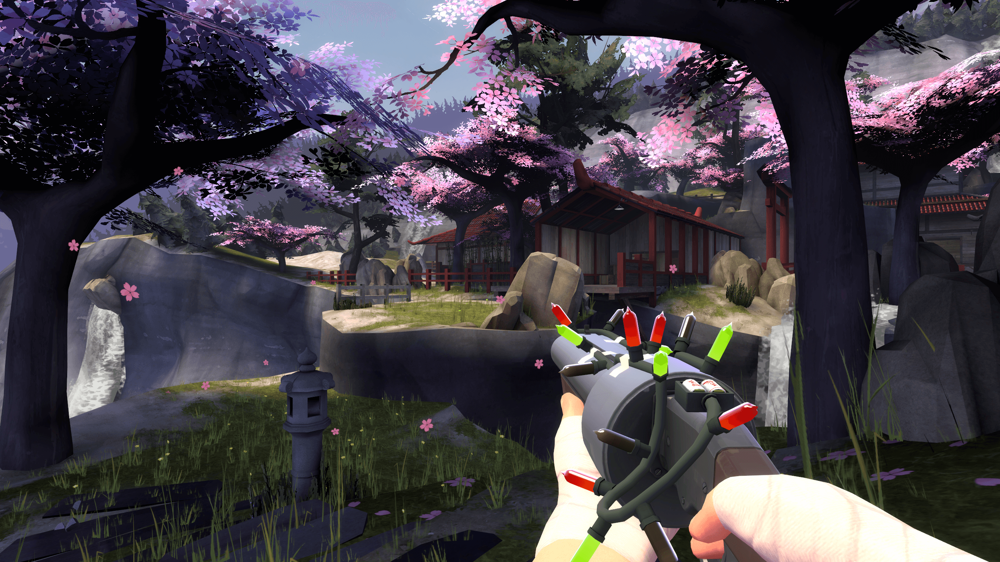
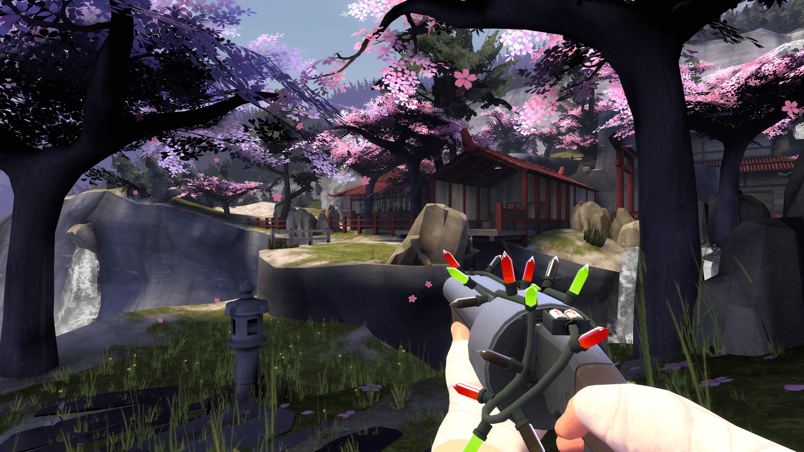
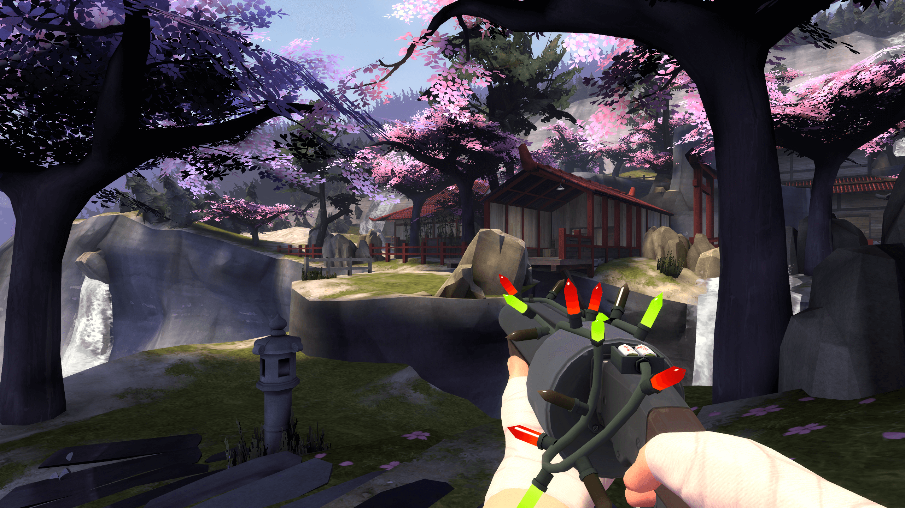
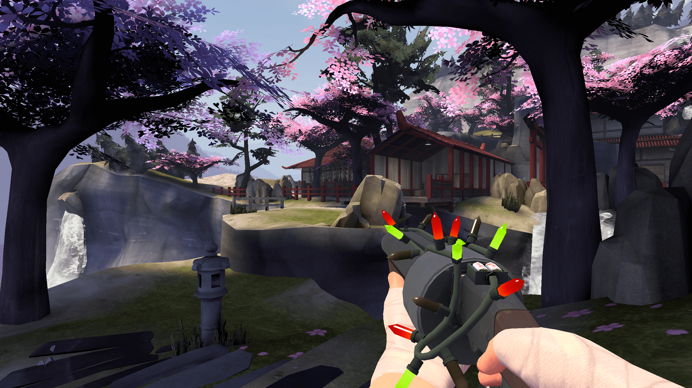
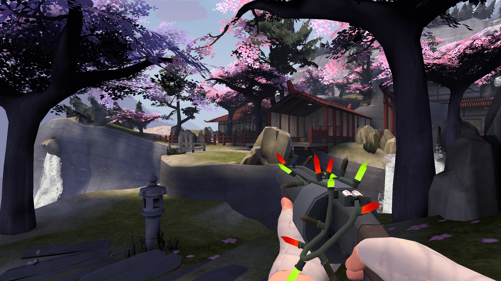
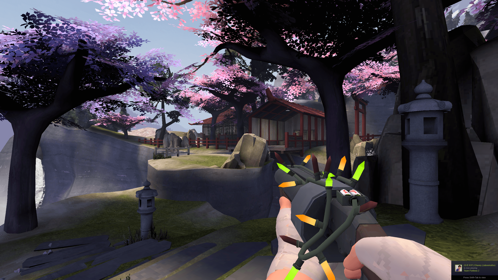
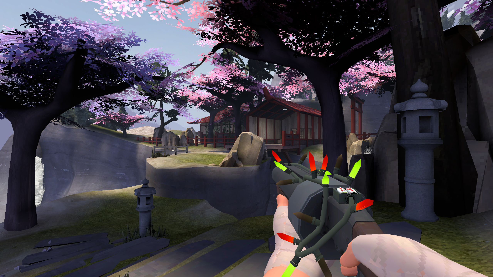

# Screenshots

## Ultra

## High

## Medium High

## Medium

## Medium Low

## Low

## Very Low

## Screenshot Notes

Taken on `koth_suijin` at `setpos -3366.353516 814.625732 -144.234741;setang 0.036519 38.112156 0.000000` with `fov_desired 75;viewmodel_fov 56`.
