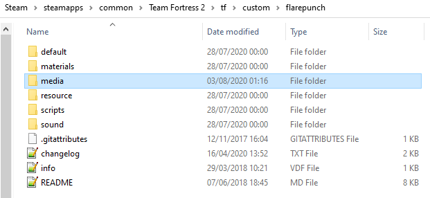

# Creating a Custom Video Intro for Team Fortress 2

_Originally posted by omnibombulator on huds.tf_

I was messing around with the TF2 files and stumbled across how the game chooses it’s intro video to play on launch. I was interested to see if I could make a Custom Intro, and it turns out it’s really easy.

Here’s how:

1. Download [The RAD Video Tools](http://www.radgametools.com/bnkdown.htm) program. This program allows you to convert video and audio files to `.bik` format, which is the format that the opening Valve video is in.

2. Open up RAD Video Tools and find your video of choice. Select the video and press the **Bink it!** button. (_See below_)

  
  

  You can mess with the above settings to get higher quality video, but leaving the settings as the default garners you a decent result.
  
  You may find that while the program attempts to render, it will give you an Error when trying to open the file. I originally tried this using videos I had downloaded online, and the program did not like it. I eventually made a small HUDS.TF intro video using Sony Vegas, and saved it as a `.avi` file. This seemed to have done the trick, and you may get the result you want by putting your videos into a Video Editor first.

3. Once converted (shouldn’t take long), watch the file back and make sure it’s okay. Audio can be a bit of a pain (may not render), so you can mix audio in after by selecting the generated `.bik` file, then pressing the **Mix in sound** button. Just add your sound file of choice and the default settings should do the rest. Again, feel free to mess around with the settings if you want to get better results.

4. Once you’ve got the file you’ve wanted, go into your Custom HUD folder. Create a media folder in the same directory your resource and scripts folders are (_example below_)

  

  Inside this folder, copy your `.bik` file into it, and create a file called startupvids.txt. Inside this file, you’ll only need one line of text, which is `media/<FILENAME>.bik`, where `<FILENAME>` is, obviously, the name of your file. (_examples below_)

  

  

1. Now open up Team Fortress 2 (make sure you do not have `-novid` in your launch options), and you’ll see the result!

Watch my example here:

<iframe src="https://youtube.com/embed/T95Ak8ENIEM" allowfullscreen></iframe>

I've also included [an example file](../../assets/files/tf2/huds/custom_intro_vid/Custom%20Intro%20for%20TF2.zip) for you to use!

!!! note
    You don’t have to put this into a Custom HUD folder. You can make a separate Custom folder for your intro video to live in individually, so it will run on every Custom HUD you use, or even on the default TF2 HUD, similar to the way you would do a hitsound. `tf/custom/introvideo/media/` and then your files would work.
