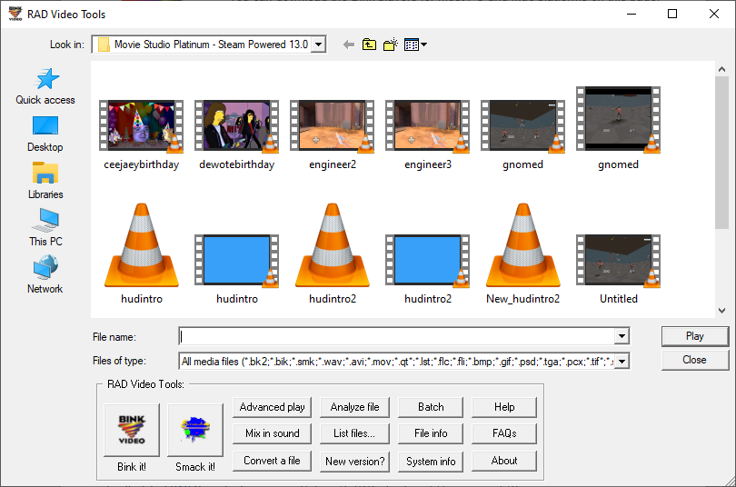
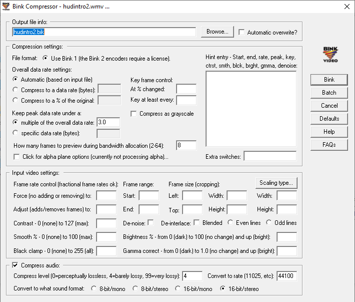
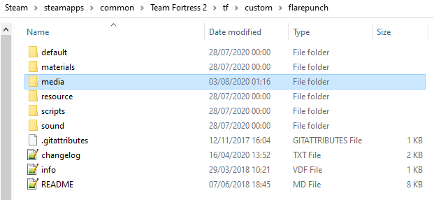
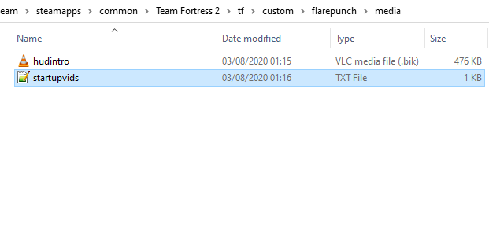
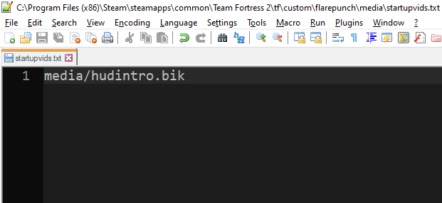

# Создание пользовательского видео интро для Team Fortress 2

!!! Заметка
    Теперь TF2 использует webm вместо Bink. Вы можете просто конвертировать видео в webm с помощью ffmpeg или любой программы для экспорта/конвертации и поместить файл webm в папку `media/`, а затем добавить его в startupvids.txt.
    Оригинальное руководство оставлено ниже в архивных целях, а также для справки по папке `media/`, в нём содержатся некоторые инструкции по её использованию.

_Оригинал опубликован omnibombulator на huds.tf_

Я копался в файлах TF2 и наткнулся на то, как игра выбирает вступительный ролик при запуске. Мне стало интересно, можно ли сделать собственное интро, и оказалось, что это очень просто.

Вот как это делается:

1. Скачайте программу [RAD Video Tools](http://www.radgametools.com/bnkdown.htm). Эта программа позволяет конвертировать видео и аудиофайлы в формат `.bik`, именно в этом формате поставляется заставка Valve.

2. Откройте RAD Video Tools и выберите нужное видео. Выберите файл и нажмите кнопку **Bink it!** (_смотрите ниже_)

  
  

  Вы можете поиграться с настройками выше, чтобы получить видео более высокого качества, но стандартные параметры дают вполне приличный результат.
  
  Возможно, во время рендеринга программа выдаст ошибку при попытке открыть файл. Изначально я пробовал использовать видео, скачанные из интернета, и программе это не понравилось. В итоге я сделал небольшое интро для HUDS.TF в Sony Vegas и сохранил его как `.avi`. Это сработало, так что, возможно, вам тоже стоит сначала пропустить видео через видеоредактор.

3. После конвертации (это не займёт много времени) посмотрите результат и убедитесь, что всё в порядке. Со звуком могут быть проблемы (он может не рендериться), поэтому вы можете добавить звук позже, выбрав созданный `.bik` файл и нажав кнопку **Mix in sound**. Просто добавьте свой аудиофайл и настройки по умолчанию сделают всё остальное. Опять же, вы можете экспериментировать с параметрами для достижения лучшего результата.

4. Когда файл готов, перейдите в папку вашего пользовательского HUD. Создайте папку `media` в той же директории, где находятся папки `resource` и `scripts` (_пример ниже_)

  

  Внутри этой папки скопируйте ваш `.bik` файл и создайте файл с именем `startupvids.txt`. Внутри этого файла должна быть всего одна строка текста: `media/<FILENAME>.bik`, где `<FILENAME>` это, очевидно, имя вашего файла. (_примеры ниже_)

  

  

5. Теперь запустите Team Fortress 2 (убедитесь, что у вас нет параметра `-novid` в параметрах запуска) и наслаждайтесь результатом!

Посмотрите мой пример здесь:

<iframe src="https://youtube.com/embed/T95Ak8ENIEM" allowfullscreen></iframe>

Я также приложил [пример файла](../../assets/files/tf2/huds/custom_intro_vid/Custom%20Intro%20for%20TF2.zip), который вы можете использовать!

!!! Заметка
    Вам не обязательно помещать это в папку пользовательского HUD. Вы можете создать отдельную папку в `custom` специально для вашего интро, чтобы оно работало с любым HUD или даже со стандартным HUD TF2, примерно так же, как вы делаете с звуками попадания. Путь `tf/custom/introvideo/media/` с вашими файлами будет работать.
