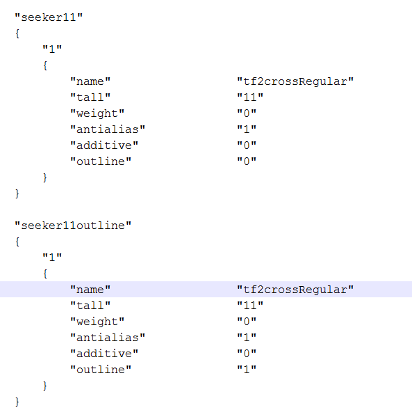
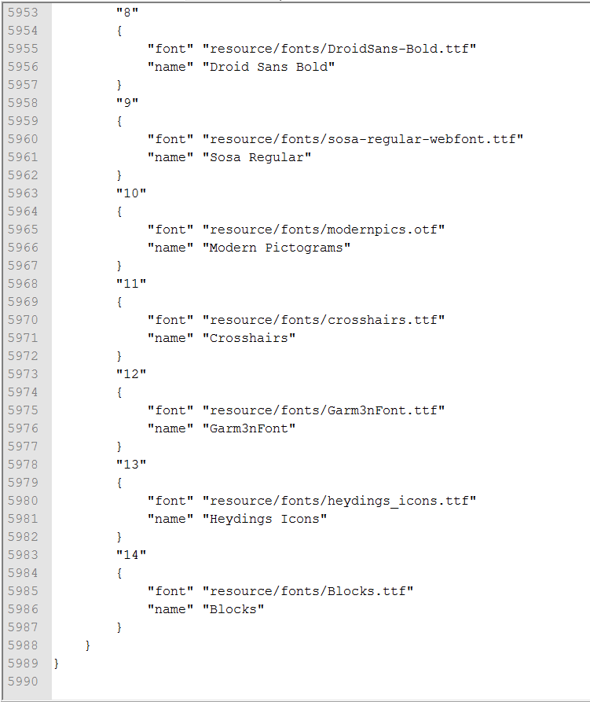
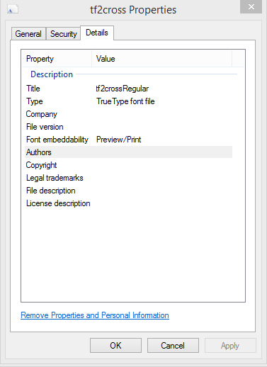
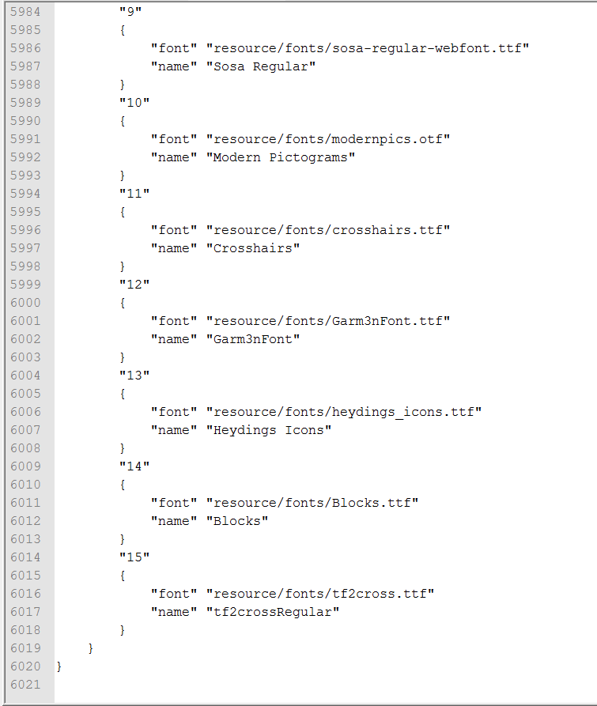
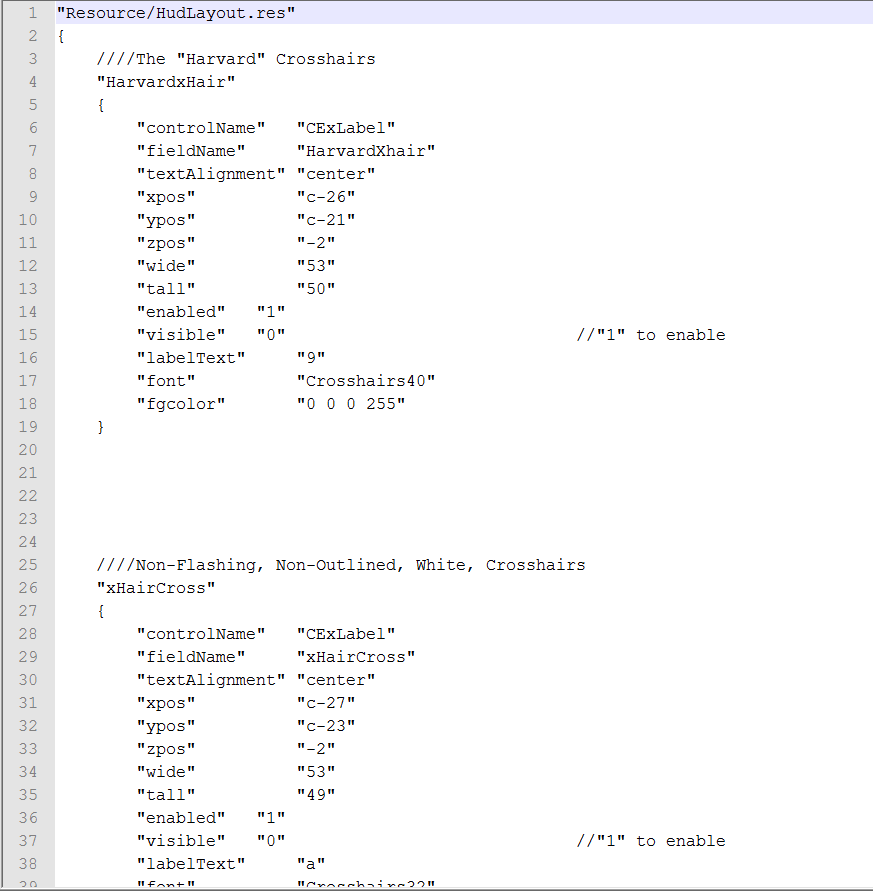
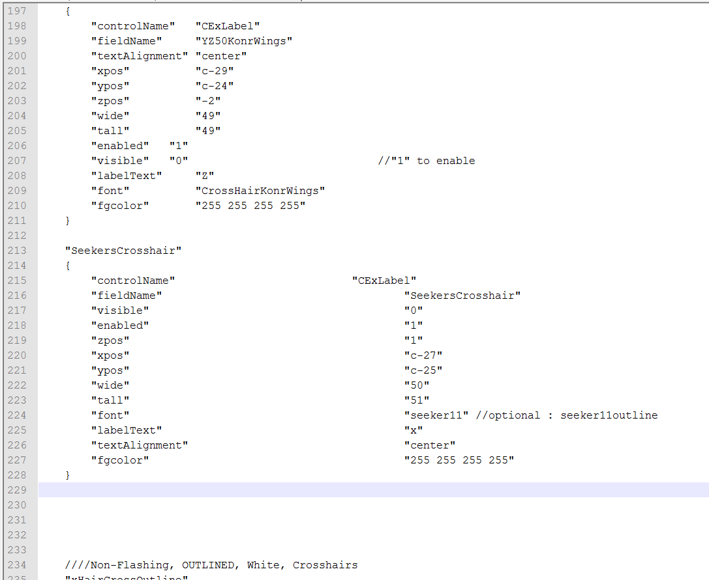
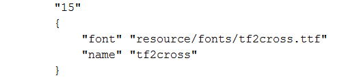
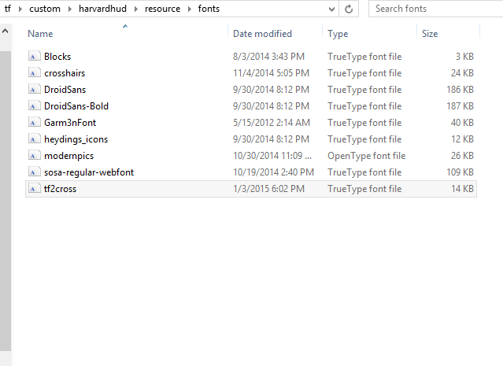
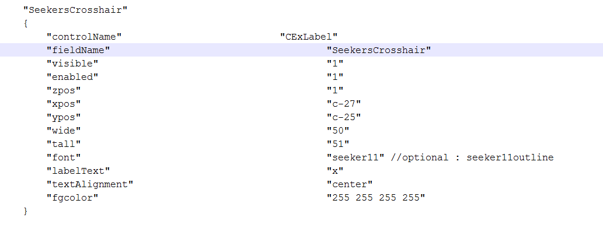

# Установка шрифтовых прицелов

_Оригинал опубликован [HarvardBB](https://github.com/harvardbb) на форуме руководств huds.tf_

Прицелы в HUD легко устанавливать, но сложно создавать. Для простоты этого руководства мы будем устанавливать готовые прицелы, а не создавать свои. Также обратите внимание: эта инструкция только для Windows, извините, пользователи Mac и Linux.

В рамках этого руководства мы будем устанавливать прицел от Seeker ([Скачать](https://raw.githubusercontent.com/Hypnootize/TF2-HUD-Crosshairs/master/crosshairs/TF2Crosshairs.ttf), [Скачать для Linux](https://raw.githubusercontent.com/Hypnootize/TF2-HUD-Crosshairs/master/crosshairs/tf2crosshairs_linux.ttf)) в мой HUD, [HARVARDHUD](https://github.com/harvardbb/harvardhud).

**Вам понадобится**

* HUD
* Notepad++(Скачать)
* Шрифтовой файл прицела на ваш выбор

**Шаг 1.**

Найдите папку с вашим HUD, это можно сделать легко зайдя в библиотеку Steam, нажмите правой кнопкой на Team Fortress 2, выберите «Свойства», перейдите на вкладку «Локальные файлы», нажмите «Просмотреть...», затем выберите папку `tf`, затем в `custom`, внутри должна быть папка вашего HUD.

**Шаг 2.**

Сначала нам нужно установить файл шрифта в HUD. Найдите файл `clientscheme.res`, перейдя в `harvardhud/resource`, и вы найдете его там. Затем нажмите CTRL+F и найдите `ECON FONTS` и прокрутите вниз, пока не найдете раздел под названием `HUD Fonts`, это имя будет отличаться от одного HUD до другого HUD, но мой HUD имеет все шрифты HUD под `HUD Fonts`. Затем вы должны добавить этот раздел кода в клиентскую схему здесь. Это даст вам гибкость, чтобы иметь перекрестие с или без подчеркивания, которое когда-либо вы предпочитаете.

```json
"seeker11"
{
        "1"
        {
                "name"                  "TF2Crosshairs"
                "tall"                  "11"
                "weight"                "0"
                "antialias"             "1"
                "outline"               "1"
        }
}
```

Должно выглядеть примерно так:



**Шаг 3.**

Теперь, всё ещё находясь внутри `clientscheme.res`, прокрутите в самый низ. Вы увидите что-то похожее на это:



Вы должны добавить этот код сразу после последнего определения шрифта, и нумерация ваших шрифтов должна идти по порядку. В моём случае шрифт прицела Seeker будет под номером `15`. Название шрифта не придумывается произвольно, это имя, под которым автор зарегистрировал шрифт, узнать точное имя любого шрифта можно, нажав на файл правой кнопкой мыши, выбрав Свойства, затем перейдя на вкладку Подробно, имя будет указано в поле `Название`.

```json
"15"
{
  "font" "resource/crosshairs/TF2Crosshairs.ttf"
  "font" "resource/crosshairs/tf2crosshairs_linux.ttf" [$LINUX]
  "name" "TF2Crosshairs"
}
```

Посмотреть тут:



Результат должен выглядеть примерно так:



**Не забудьте сохранить файл!**

**Шаг 4.**

Найдите файл `hudlayout.res` по пути `harvardhud/scripts` и он будет там. В большинстве HUD прицелы находятся в самом начале, как и в моём. Мой HUD немного сложнее других, так как у меня есть предварительно анимированные и с контуром прицелы на выбор. Вы можете установить прицел в любое место файла, но для порядка я буду делать это определённым образом, вы же можете разместить его в самом верху, если хотите.

При первом открытии файл должен выглядеть примерно так:



Теперь нажмите CTRL+F и найдите "YZ50KonrWings" как я буду устанавливать прицел Seeker прямо под этим пунктом. Это только для моего HUD, ваш, скорее всего, будет отличаться. Теперь вставьте этот блок кода в файл.

Должно получиться примерно так:



Если вы хотите изменить цвет перекрестия, вы должны отредактировать `fgcolor`, вы можете выбрать цвет, используя это, чтобы помочь вам выбрать цвет, обратите внимание, что первая цифра является красным значением, вторая цифра это зеленым, третий это синий, а последняя цифра это альфа канал или значение прозрачности, вы должны оставить это на `255`, если вы действительно не хотите прозрачного перекрестия (чего большинство не делает). Если прицел не по центру, придётся поиграться с параметрами `xpos`, `ypos`, `wide` и `tall`. Иногда это мучительный процесс, но я почти уверен, что прицел Seeker уже идеально отцентрирован, так что не трогайте эти параметры, если только вы не уверены, что он смещён.

**Не забудьте сохранить файл!**

**Финальный шаг.**

Теперь возьмите шрифтовой файл, о котором мы говорили ранее, и установите его в HUD. В большинстве HUD есть выделенная папка `fonts`, обычно по пути `harvardhud/resource/fonts` и просто поместите файл туда. Обратите внимание: путь к установленному шрифту в клиентской схеме должен совпадать.

Смотрите:



Обратите внимание, что путь совпадает.
Конечный результат в папке со шрифтами должен выглядеть примерно так:



**Включение шрифта самая простая часть.**

Всё, что вам нужно сделать зайти в файл `hudlayout.res` в `harvardhud/scripts`, найти нужный прицел и установить значения `enabled` и `visible` в `1`. Хотя в большинстве HUD, включая мой, все прицелы включены, но не видны, так что, скорее всего, вам нужно будет изменить только `visible`.

Включение прицела Seeker будет выглядеть так:



**И, конечно же, не забудьте сохранить файл!**

Прошу прощения за простыню текста и сумбурный гайд, но надеюсь, он поможет.
